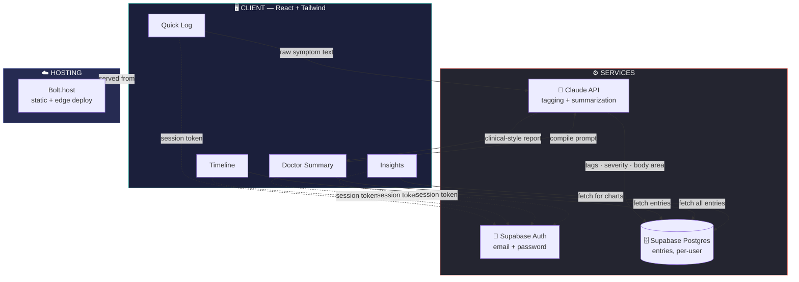

 

# 🩺 Silent Symptom

### Turning scattered symptoms into a doctor-ready story.

 

*Built in 8 hours at **HACKDAY 1.0** · Theme: Tech for a Better Tomorrow*

 

 

 

---

 

## 📍 Table of Contents

- [The Problem](#-the-problem)
- [The Solution](#-the-solution)
- [Who It's For](#-who-its-for)
- [System Architecture](#️-system-architecture)
- [User Flow](#-user-flow)
- [Tech Stack](#️-tech-stack)
- [Live Demo](#-live-demo)
- [Market Snapshot](#-market-snapshot)
- [Changelog](#️-changelog)
- [Roadmap](#-roadmap)
- [Team](#-team)

 

---

## 💭 The Problem

 

> *"It's not that the symptoms aren't real — it's that they're never organized long enough to become visible."*

 

Conditions like **endometriosis**, **autoimmune disorders**, and **chronic fatigue** take an average of **7–10 years** to diagnose. Not because the symptoms aren't there — but because they arrive one quiet complaint at a time. A headache here. Bad sleep there. Too minor to mention on their own, too scattered to ever add up to a pattern — until years have passed.

**Silent Symptom exists to close that gap.**

 

---

## ✨ The Solution

 

<table>
<tr>
<td width="25" align="center">📝</td>
<td><b>Quick Log</b> Write freely — no medical vocabulary needed. AI quietly extracts symptoms, severity, and body area.</td>
</tr>
<tr>
<td align="center">📅</td>
<td><b>Timeline</b> A tag-filterable history of every entry. Flag the ones that matter most for your next appointment.</td>
</tr>
<tr>
<td align="center">🩺</td>
<td><b>Doctor Summary</b> One click compiles weeks of notes into a clean, clinical-style report — copy, print, or export as PDF.</td>
</tr>
<tr>
<td align="center">📊</td>
<td><b>Insights</b> Visual patterns in frequency and severity over time — spot the trend before your doctor even asks.</td>
</tr>
</table>

 

---

## 👥 Who It's For

 

| | |
|:---:|---|
| ❤️ | **Underdiagnosed patients** — living with conditions that take years to name |
| ✦ | **Caregivers** — tracking symptoms on behalf of someone who can't log it themselves |
| ⚕️ | **Doctors & specialists** — who want structure instead of a scattered verbal recap |
| ◈ | **Health-conscious individuals** — building self-awareness before it becomes a problem |

 

---

## 🏗️ System Architecture

 

 

---

## 🔁 User Flow

```mermaid
flowchart LR
    A([Open app]) --> B{Logged in?}
    B -- no --> C[Sign Up / Login]
    C --> D[Session created]
    D --> E["Seeded with\nsample history"]
    B -- yes --> F[Quick Log entry]
    E --> F
    F --> G["Claude extracts\ntags + severity"]
    G --> H[(Saved to Supabase)]
    H --> I[Appears on Timeline]
    I --> J{Flag it?}
    J -- yes --> K[Pinned for summary]
    J -- no --> L[Chronological order]
    K --> M[Generate Doctor Summary]
    L --> M
    M --> N["Claude compiles\nclinical report"]
    N --> O[Copy / Print / PDF]
    O --> P([Bring to appointment])

    style A fill:#3EC6B6,color:#1B1F3B
    style P fill:#FF6F61,color:#1B1F3B
    style G fill:#3D4B94,color:#FAFAF8
    style N fill:#3D4B94,color:#FAFAF8
```

 

 

---

## 🛠️ Tech Stack

 

| Layer | Technology | Why |
|---|---|---|
| **Frontend** | React 18 + Tailwind CSS | Fast iteration under hackathon time pressure, fully responsive |
| **Auth & Database** | Supabase | Real accounts & private data, without hand-rolling a backend |
| **Intelligence** | Claude (Anthropic API) | Structures free-text into tags, severity, and clinical summaries |
| **Visualization** | Recharts | Native charting for the Insights panel |
| **Hosting** | Bolt.new / Bolt.host | Zero-config deploy, live link in seconds |

 

---

## 🔗 Live Demo

 

### **[→ silent-symptom-healt-2k83.bolt.host](https://silent-symptom-healt-2k83.bolt.host/)**

 

1. Sign up — a short sample history will already be waiting
2. Log a few entries in your own words, across a few "days"
3. Open **Doctor Summary** → click **Generate**
4. Watch weeks of scattered notes become a 30-second-skim report
5. Toggle dark mode, just to see that it holds up too

 

---

## 📈 Market Snapshot

 

| Metric | Value |
|---|---|
| Digital health market size (2025) | **$573B** |
| Projected market size (2034) | **$2.09T** |
| CAGR (2026–2034) | **15%** |

Source: IMARC Group, Digital Health Market Report, 2025

**Business model:** Freemium (free logging, paid AI summaries/PDF export) · B2B2C (clinics, therapists, insurers) · API licensing (telehealth & EHR platforms)

 

---

## 🗓️ Changelog

 

**`v1.2`** — Security & Polish
Password strength UX, show/hide toggle, kinder error messages · full UI refinement pass (spacing, hover states, typography) · dark mode audited end-to-end, charts included

**`v1.1`** — It Got Real
Migrated localStorage → Supabase (auth + database) · entries persist per authenticated account · new signups auto-seeded with sample history

**`v1.0`** — Genesis
Born at HACKDAY 1.0 in one 8-hour sitting · core pipeline working end-to-end · light/dark theme and calm visual design established

 

---

## 🌱 Roadmap

 

- [ ] **Wearable integration** — sleep & heart-rate data correlated with symptoms
- [ ] **Clinician dashboard** — doctor-side view for flagged entries pre-visit
- [ ] **Community insights** — anonymized, opt-in pattern-sharing
- [ ] **Multi-language support** — dismissal isn't an English-only problem
- [ ] **Voice-based logging** — speak an entry on low-energy, high-pain days
- [ ] **Deeper EHR handoff** — direct, secure export into patient portals

 

---

## 👩‍💻 Team

 

**Shreya** — [@shreya2707-glitch](https://github.com/shreya2707-glitch)
*Solo build, 8 hours, HACKDAY 1.0*

 

---

 

*Not a diagnosis. Just a pattern, finally organized enough for someone to believe.*

**For personal symptom tracking only — always consult a licensed healthcare professional.**

 

### Built in 8 hours. Designed to matter for years. 🩺

 

